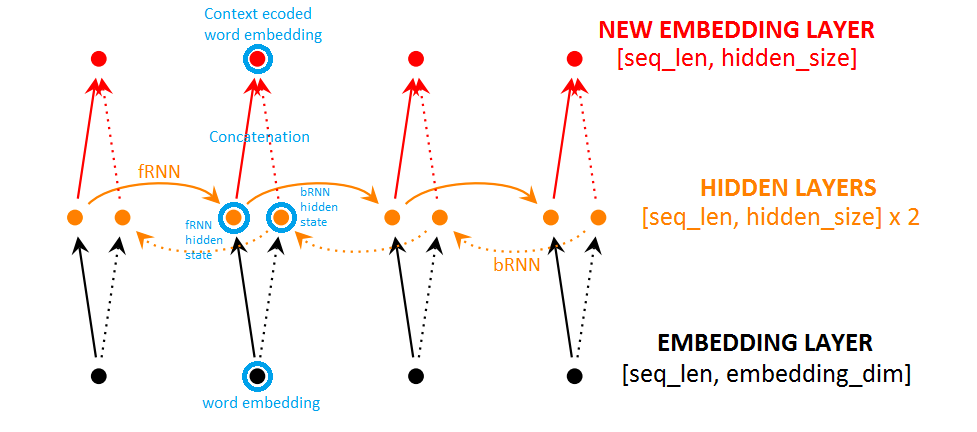
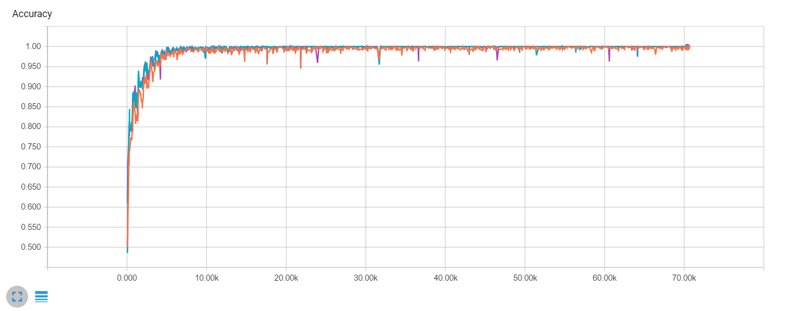
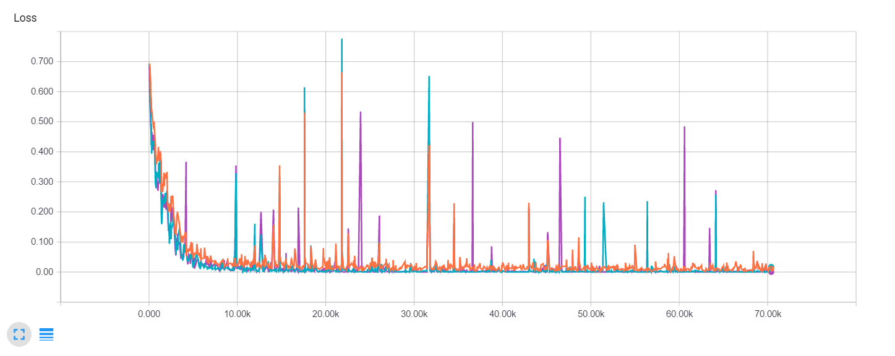
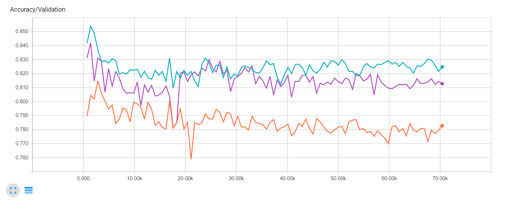
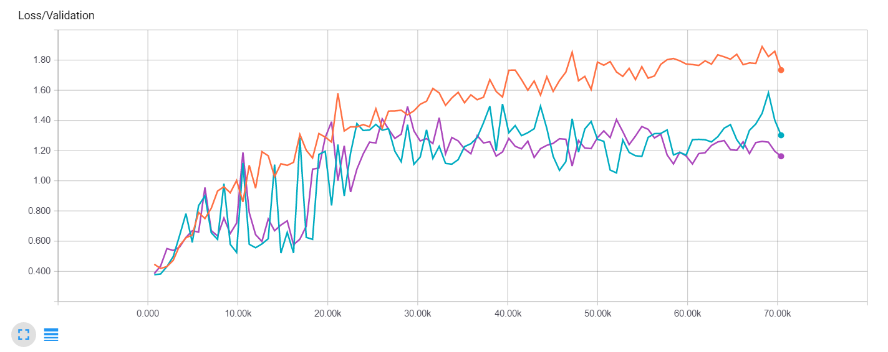

# Overview
A word embedding is a paramaterized function which maps words in some language to high-dimensional vectors. Converting words to such vector embeddings before passing them into deep neural networks has proved to be a highly effective technique for text classification tasks. 

Presented here is a novel method to modify the embeddings of a word in a sentence with its surrounding context using a bidirectional Recurrent Neural Network (RNN). The hypothesis is that these modified embeddings are a better input for text classification networks. This repository contains code implementations, experimental results and visualizations.

**NOTE:** [The idea is actually not novel and works so well that it's even used in Google Translate's architecture.](https://github.com/chaitjo/lstm-context-embeddings#a-note-on-novelty)

# Naive Example
Given the embeddings for all the words in a sentence like *'the quick brown fox jumps over the lazy dog'*, the proposed model modifies the existing embedding for *'fox'* to incorporate information about it being *'quick'* and *'brown'*, and the fact that it *'jumps over'* the *'dog'* (whose updated embedding now reflect that its *'lazy'* and got *'jumped over'* by the *'fox'*). 

Applied in combination with pre-trained word embeddings (like [word2vec](https://code.google.com/archive/p/word2vec/) or [GloVe](http://nlp.stanford.edu/projects/glove/)) which encode global syntactic and semantic information about words such as *'fox'* and *'dog'*, the method adds local context to these embeddings based on surrounding words. The new embeddings can then be fed into a text classification network.

# Model


Given the word embeddings for each word in a sentence/sequence of words, the sequence can be represented as a 2-D tensor of shape (`seq_len`, `embedding_dim`). The following steps can be performed to add infomation about the surrounding words to each embedding- 

1. Pass the embedding of each word sequentially into a forward-directional RNN (fRNN). For each sequential timestep, we obtain the hidden state of the fRNN, a tensor of shape (`hidden_size`). The hidden state encodes information about the current word and all the words previously encountered in the sequence. Our final output from the fRNN is a 2-D tensor of shape (`seq_len`, `hidden_size`). 

2. Pass the embedding of each word sequentially (after reversing the sequence of words) into a backward-directional RNN (bRNN). For each sequential timestep, we again obtain the hidden state of the bRNN, a tensor of shape (`hidden_size`). The hidden state encodes information about the current word and all the words previously encountered in the sequence. Our output is a 2-D tensor of shape (`seq_len`, `hidden_size`). This output is reversed again to obtain the final output of the bRNN. 

3. Concatenate the fRNN and bRNN outputs element-wise for each of the `seq_len` timesteps in the two outputs. The final output is another 2-D tensor of shape (`seq_len`, `hidden_size`).

**The fRNN and bRNN together form a bidirectional RNN. The difference between the final outputs of fRNN and bRNN is that at each timestep they are encoding information about two different sub-sequences (which are formed by splitting the sequence at the word at that timestep). Concatenating these outputs at each timestep results in a tensor encoding information about the word at that timestep and all the words in the sequence to its left and right.**

The cells used in the RNNs are the [Long Short-term Memory (LSTM)](http://deeplearning.cs.cmu.edu/pdfs/Hochreiter97_lstm.pdf) cells, which are better at capturing long-term dependencies than vanilla RNN cells. This ensures our model doesn't just consider the nearest neighbours while modifying a word's embedding.

# A note on novelty...
I had this idea when I was studying word embeddings and how to combine them with deep neural networks for text classification. I started writing the code in July 2016 and learnt much later that the technique I was proposing had already been discussed in some very popular papers in Machine Translation. It's a part of the architecture of Google Translate's new [Zero-Shot Multilingual Translation](https://arxiv.org/pdf/1611.04558v1.pdf) system (see Section 3.2 of [this paper](https://arxiv.org/pdf/1609.08144v2.pdf)) and had first been proposed by [Bahdanou et al](https://arxiv.org/pdf/1409.0473v7.pdf) in 2014 (see Section 3).

To paraphrase Bahdanou et al, *"We obtain an annotation for each word by concatenating the forward and backward states of a bidirectional RNN. The annotation contains the summaries of both the preceding words and the following words. Due to the tendency of RNNs to better represent recent inputs, the annotation will contain information about the whole input sequence with a strong focus on the parts surrounding the anotated word."*

Google Translate is probably the best example of a product leveraging neural networks and it's bittersweet that my idea is a tiny part of it. I really thought I had come up with something new that could be published! However, this proves that I was thinking along the right track and that the idea works exactly as intended. I am yet to encounter a paper which studies this method rigourously or has applied it in the context of sentiment analysis. 

# Implementation
The code implements the proposed model as a pre-processing layer before feeding it into a [Convolutional Neural Network for Sentence Classification](https://arxiv.org/pdf/1408.5882v2.pdf) (Kim, 2014). Two implementations are provided to run experiments- one with [tensorflow](https://www.tensorflow.org/) and one with [tflearn](http://tflearn.org/) (A high-level API for tensorflow). Training happens end-to-end in a supervised manner- the RNN layer is simply inserted as part of the existing model's architecture for text classification.

The tensorflow version is built on top of [Denny Britz's implementation of Kim's CNN](https://github.com/dennybritz/cnn-text-classification-tf), and also allows loading pre-trained word2vec embeddings. 

Although both versions work exactly as intended, the repository currently contains results from experiments with the tflearn version only. More results will be added as soon.

# Datasets
The dataset chosen for training and testing the tensorflow code is the [Pang & Lee Movie Reviews](http://www.cs.cornell.edu/people/pabo/movie-review-data/) dataset. For the tflearn version, we experiment on the [IMDb Movie Reviews Dataset](http://www.iro.umontreal.ca/~lisa/deep/data/imdb.pkl) by UMontreal. Classification involves detecting positive or negative reviews in both cases.

# Experiments
The following three models were considered- (Implementations can be found in `/tflearn`)

1. Kim's [baseline CNN model](res/cnn-128.png?raw=true) without the RNN layer, `embedding_dim = 128`, `num_filters = 128` **[ORANGE]**
2. [The proposed model](res/lstm%2Bcnn-128.png?raw=true), `embedding_dim = 128`, `rnn_hidden_size = 128`, `num_filters = 128` **[PURPLE]**
3. [The proposed model with more capacity](res/lstm%2Bcnn-300.png?raw=true), `embedding_dim = 300`, `rnn_hidden_size = 300`, `num_filters = 150` **[BLUE]**

All models were trained with the following hyperparameters using the Adam optimizer- `num_epochs = 100`, `batch_size = 32`, `learning_rate = 0.001`. Ten percent of the data was held out for validation.

# Results
Training Accuracy-


Training Loss- 


It's clear that training converges for all three models much before 100 epochs.

Validation Accuracy-


Vallidation Loss-


Higher Validation Accuracy (~3%) and lower Validation Loss for the model compared to the baseline suggests that adding the bidirectional RNN layer after the word embedding layer improves a generic text classification model's performance.

**An unanswered question is whether the bump in accuracy is because the RNN layer actually added contextual information to independent word embeddings or simply because the model became larger overall. However, adding more capacity to the model (by increasing number of hidden neurons in the RNN and number of CNN filters) does not lead to drastic changes in accuracy, suggesting that the former is true.**

It's also extremely worrying to see the validation loss increasing instead of decreasing as training continues. This issue needs investigation.

# Ideas and Next Steps
1. Visualizations of the modified embeddings in a sequence can be compared to their original embeddings to confirm that their modification is due to their surrounding words and is not random.

2. An `n` layer vanilla neural network for text classification can be compared to a model with the RNN layer followed by an `n-1` layer vanilla network. This should be a 'fairer fight' than a deep-CNN vs RNN-followed-by-deep-CNN in terms of number of parameters.

3. Experiments can be carried out on initialization using pre-trained embeddings and passing them as trainable vs non-trainable parameters to the RNN layer; i.e. whether or not we backpropagate errors into the original embedding layer.

4. Experiments can be performed to determine the optimum depth of the RNN layer for different kinds of models on top of it. (Currently it's a single layer, but the concept can easily be extended to multilayer bidirectional RNNs.)

# Usage
Tensorflow code is divided into `model.py` which abstracts the model as a class, and `train.py` which is used to train the model. It can be executed by running the `train.py` script (with optional flags to set hyperparameters)-
```
$ python train.py [--flag=1]
```
(Tensorflow code for Kim's baseline CNN can be found in `/cnn-model`.)

Tflearn code can be found in the `/tflearn` folder and can be run directly to start training (with optional flags to set hyperparameters)-
```
$ python tflearn/model.py [--flag=1]
```

The summaries generated during training (saved in `/runs` by default) can be used to visualize results using tensorboard with the following command-
```
$ tensorboard --logdir=<path_to_summary>
```
